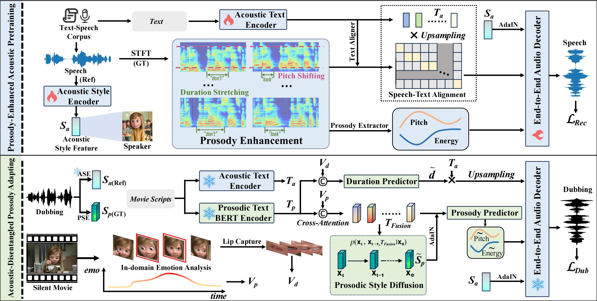

## Prosody-Enhanced Acoustic Pre-training and Acoustic-Disentangled Prosody Adapting for Movie Dubbing

[Result in Dub 1.0 Setting](#Setting1V2C) \
[Result in Dub 2.0 Setting](#Setting2V2C) \
[Result of Zero-shot test](#zeroshot)

## Abstract
Movie dubbing describes the process of transforming a script into speech that aligns temporally and emotionally with a given movie clip while exemplifying the speaker’s voice demonstrated in a short reference audio clip. This task demands the model bridge character performances and complicated prosody structures to build a high-quality video-synchronized dubbing track. The limited scale of movie dubbing datasets, along with the background noise inherent in audio data, hinder the acoustic modeling performance of trained models. To address these issues, we propose an acoustic-prosody disentangled two-stage method to achieve high-quality dubbing generation with precise prosody alignment. First, we propose a prosody-enhanced acoustic pre-training to develop robust acoustic modeling capabilities. Then, we freeze the pre-trained acoustic system and design a disentangled framework to model prosodic text features and dubbing style while maintaining acoustic quality. Additionally, we incorporate an in-domain emotion analysis module to reduce the impact of visual domain shifts across different movies, thereby enhancing emotion-prosody alignment. Extensive experiments show that our method performs favorably against the state-of-the-art models on two primary benchmarks. The official demos are available here.

### V2C-Animation sample on Dub 1.0
### Sample #1
#### Script: You see, babies aren't getting as much love as we used to.
<table border="1">
    <tr>
        <td>
<video width="330" height="170" controls>
  <source src="Setting1/Sample1/V2C-Net_Bossbaby@BossBaby_00_0326_00.mp4" type="video/mp4">
  Your browser does not support the video tag.
</video>
<figcaption>V2C-Net</figcaption>
        </td>
        <td>
<video  width="330" height="170" controls>
  <source src="Setting1/Sample1/HPMDubbing_Bossbaby@BossBaby_00_0326_00.mp4" type="video/mp4">
  Your browser does not support the video tag.
</video>
<figcaption>HPMDubbing</figcaption>
        </td>
        <td>
<video  width="330" height="170" controls>
  <source src="Setting1/Sample1/StyleDubber_Bossbaby@BossBaby_00_0326_00.mp4" type="video/mp4">
  Your browser does not support the video tag.
</video>
<figcaption>StyleDubber</figcaption>
        </td>
    </tr>
    <tr>
        <td>
<video  width="330" height="170" controls>
  <source src="Setting1/Sample1/Speaker2Dubber_Bossbaby@BossBaby_00_0326_00.mp4" type="video/mp4">
  Your browser does not support the video tag.
</video>
<figcaption>Speaker2Dubber</figcaption>
        </td>
        <td>
<video  width="330" height="170" controls>
  <source src="Setting1/Sample1/Ours_Bossbaby@BossBaby_00_0326_00.mp4" type="video/mp4">
  Your browser does not support the video tag.
</video>
<figcaption>Ours</figcaption>
        </td>
        <td>
<video  width="330" height="170" controls>
  <source src="Setting1/Sample1/Bossbaby@BossBaby_00_0326_00.mp4" type="video/mp4">
  Your browser does not support the video tag.
</video>
<figcaption>GT</figcaption>
        </td>
    </tr>
</table>

### Sample #2
#### Script: Wow, they're shiny. I'm sam.
<table border="1">
    <tr>
        <td>
<video width="330" height="170" controls>
  <source src="Setting1/Sample2/V2C-Net_Cloudy@Samantha_00_0312_00.mp4" type="video/mp4">
  Your browser does not support the video tag.
</video>
<figcaption>V2C-Net</figcaption>
        </td>
        <td>
<video  width="330" height="170" controls>
  <source src="Setting1/Sample2/HPMDubbing_Cloudy@Samantha_00_0312_00.mp4" type="video/mp4">
  Your browser does not support the video tag.
</video>
<figcaption>HPMDubbing</figcaption>
        </td>
        <td>
<video  width="330" height="170" controls>
  <source src="Setting1/Sample2/StyleDubber_Cloudy@Samantha_00_0312_00.mp4" type="video/mp4">
  Your browser does not support the video tag.
</video>
<figcaption>StyleDubber</figcaption>
        </td>
    </tr>
    <tr>
        <td>
<video  width="330" height="170" controls>
  <source src="Setting1/Sample2/Speaker2Dubber_Cloudy@Samantha_00_0312_00.mp4" type="video/mp4">
  Your browser does not support the video tag.
</video>
<figcaption>Speaker2Dubber</figcaption>
        </td>
        <td>
<video  width="330" height="170" controls>
  <source src="Setting1/Sample2/Ours_Cloudy@Samantha_00_0312_00.mp4" type="video/mp4">
  Your browser does not support the video tag.
</video>
<figcaption>Ours</figcaption>
        </td>
        <td>
<video  width="330" height="170" controls>
  <source src="Setting1/Sample2/Cloudy@Samantha_00_0312_00.mp4" type="video/mp4">
  Your browser does not support the video tag.
</video>
<figcaption>GT</figcaption>
        </td>
    </tr>
</table>

### Sample #3
#### Script: And everyone had to go on this long, sucky walk.
<table border="1">
    <tr>
        <td>
<video width="330" height="170" controls>
  <source src="Setting1/Sample3/V2C-Net_Croods@Grug_00_0552_00.mp4" type="video/mp4">
  Your browser does not support the video tag.
</video>
<figcaption>V2C-Net</figcaption>
        </td>
        <td>
<video  width="330" height="170" controls>
  <source src="Setting1/Sample3/HPMDubbing_Croods@Grug_00_0552_00.mp4" type="video/mp4">
  Your browser does not support the video tag.
</video>
<figcaption>HPMDubbing</figcaption>
        </td>
        <td>
<video  width="330" height="170" controls>
  <source src="Setting1/Sample3/StyleDubber_Croods@Grug_00_0552_00.mp4" type="video/mp4">
  Your browser does not support the video tag.
</video>
<figcaption>StyleDubber</figcaption>
        </td>
    </tr>
    <tr>
        <td>
<video  width="330" height="170" controls>
  <source src="Setting1/Sample3/Speaker2Dubber_Croods@Grug_00_0552_00.mp4" type="video/mp4">
  Your browser does not support the video tag.
</video>
<figcaption>Speaker2Dubber</figcaption>
        </td>
        <td>
<video  width="330" height="170" controls>
  <source src="Setting1/Sample3/Ours_Croods@Grug_00_0552_00.mp4" type="video/mp4">
  Your browser does not support the video tag.
</video>
<figcaption>Ours</figcaption>
        </td>
        <td>
<video  width="330" height="170" controls>
  <source src="Setting1/Sample3/Croods@Grug_00_0552_00.mp4" type="video/mp4">
  Your browser does not support the video tag.
</video>
<figcaption>GT</figcaption>
        </td>
    </tr>
</table>

### Sample #4
#### Script: Sly fox, dumb bunny.
<table border="1">
    <tr>
        <td>
<video width="330" height="170" controls>
  <source src="Setting1/Sample4/V2C-Net_Zootopia@Nick_00_0410_00.mp4" type="video/mp4">
  Your browser does not support the video tag.
</video>
<figcaption>V2C-Net</figcaption>
        </td>
        <td>
<video  width="330" height="170" controls>
  <source src="Setting1/Sample4/HPMDubbing_Zootopia@Nick_00_0410_00.mp4" type="video/mp4">
  Your browser does not support the video tag.
</video>
<figcaption>HPMDubbing</figcaption>
        </td>
        <td>
<video  width="330" height="170" controls>
  <source src="Setting1/Sample4/StyleDubber_Zootopia@Nick_00_0410_00.mp4" type="video/mp4">
  Your browser does not support the video tag.
</video>
<figcaption>StyleDubber</figcaption>
        </td>
    </tr>
    <tr>
        <td>
<video  width="330" height="170" controls>
  <source src="Setting1/Sample4/Speaker2Dubber_Zootopia@Nick_00_0410_00.mp4" type="video/mp4">
  Your browser does not support the video tag.
</video>
<figcaption>Speaker2Dubber</figcaption>
        </td>
        <td>
<video  width="330" height="170" controls>
  <source src="Setting1/Sample4/Ours_Zootopia@Nick_00_0410_00.mp4" type="video/mp4">
  Your browser does not support the video tag.
</video>
<figcaption>Ours</figcaption>
        </td>
        <td>
<video  width="330" height="170" controls>
  <source src="Setting1/Sample4/Zootopia@Nick_00_0410_00.mp4" type="video/mp4">
  Your browser does not support the video tag.
</video>
<figcaption>GT</figcaption>
        </td>
    </tr>
</table>

### Sample #5
#### Script: Do you have to go now? I mean, you know, it's getting late.
<table border="1">
    <tr>
        <td>
<video width="330" height="170" controls>
  <source src="Setting1/Sample5/V2C-Net_Meet@Franny_00_0963_00.mp4" type="video/mp4">
  Your browser does not support the video tag.
</video>
<figcaption>V2C-Net</figcaption>
        </td>
        <td>
<video  width="330" height="170" controls>
  <source src="Setting1/Sample5/HPMDubbing_Meet@Franny_00_0963_00.mp4" type="video/mp4">
  Your browser does not support the video tag.
</video>
<figcaption>HPMDubbing</figcaption>
        </td>
        <td>
<video  width="330" height="170" controls>
  <source src="Setting1/Sample5/StyleDubber_Meet@Franny_00_0963_00.mp4" type="video/mp4">
  Your browser does not support the video tag.
</video>
<figcaption>StyleDubber</figcaption>
        </td>
    </tr>
    <tr>
        <td>
<video  width="330" height="170" controls>
  <source src="Setting1/Sample5/Speaker2Dubber_Meet@Franny_00_0963_00.mp4" type="video/mp4">
  Your browser does not support the video tag.
</video>
<figcaption>Speaker2Dubber</figcaption>
        </td>
        <td>
<video  width="330" height="170" controls>
  <source src="Setting1/Sample5/Ours_Meet@Franny_00_0963_00.mp4" type="video/mp4">
  Your browser does not support the video tag.
</video>
<figcaption>Ours</figcaption>
        </td>
        <td>
<video  width="330" height="170" controls>
  <source src="Setting1/Sample5/Meet@Franny_00_0963_00.mp4" type="video/mp4">
  Your browser does not support the video tag.
</video>
<figcaption>GT</figcaption>
        </td>
    </tr>
</table>

### V2C-Animation sample on Dub 2.0
### Sample #1
#### Script: Your father's out there "entertaining" them.
Reference Audio：

<audio controls src="Setting2/Sample1/Brave@Elinor_00_0171_00.wav" title="Title"></audio>
<table border="1">
    <tr>
        <td>
<video width="330" height="170" controls>
  <source src="Setting2/Sample1/V2C-Net_Ours_Brave@Elinor_00_0486_00.mp4" type="video/mp4">
  Your browser does not support the video tag.
</video>
<figcaption>V2C-Net</figcaption>
        </td>
        <td>
<video  width="330" height="170" controls>
  <source src="Setting2/Sample1/HPMDubbing_Ours_Brave@Elinor_00_0486_00.mp4" type="video/mp4">
  Your browser does not support the video tag.
</video>
<figcaption>HPMDubbing</figcaption>
        </td>
        <td>
<video  width="330" height="170" controls>
  <source src="Setting2/Sample1/StyleDubber_Ours_Brave@Elinor_00_0486_00.mp4" type="video/mp4">
  Your browser does not support the video tag.
</video>
<figcaption>StyleDubber</figcaption>
        </td>
    </tr>
    <tr>
        <td>
<video  width="330" height="170" controls>
  <source src="Setting2/Sample1/Speaker2Dubber_Ours_Brave@Elinor_00_0486_00.mp4" type="video/mp4">
  Your browser does not support the video tag.
</video>
<figcaption>Speaker2Dubber</figcaption>
        </td>
        <td>
<video  width="330" height="170" controls>
  <source src="Setting2/Sample1/Ours_Brave@Elinor_00_0486_00.mp4" type="video/mp4">
  Your browser does not support the video tag.
</video>
<figcaption>Ours</figcaption>
        </td>
        <td>
<video  width="330" height="170" controls>
  <source src="Setting2/Sample1/Brave@Elinor_00_0486_00.mp4" type="video/mp4">
  Your browser does not support the video tag.
</video>
<figcaption>GT</figcaption>
        </td>
    </tr>
</table>

### Sample #2
#### Script: My chest hairs are tingling. Something's wrong.
Reference Audio：

<audio controls src="Setting2/Sample2/Cloudy@Earl_00_0548_00.wav" title="Title"></audio>

<table border="1">
    <tr>
        <td>
<video width="330" height="170" controls>
  <source src="Setting2/Sample2/V2C-Net_Cloudy@Earl_00_0253_00.mp4" type="video/mp4">
  Your browser does not support the video tag.
</video>
<figcaption>V2C-Net</figcaption>
        </td>
        <td>
<video  width="330" height="170" controls>
  <source src="Setting2/Sample2/HPMDubbing_Cloudy@Earl_00_0253_00.mp4" type="video/mp4">
  Your browser does not support the video tag.
</video>
<figcaption>HPMDubbing</figcaption>
        </td>
        <td>
<video  width="330" height="170" controls>
  <source src="Setting2/Sample2/StyleDubber_Cloudy@Earl_00_0253_00.mp4" type="video/mp4">
  Your browser does not support the video tag.
</video>
<figcaption>StyleDubber</figcaption>
        </td>
    </tr>
    <tr>
        <td>
<video  width="330" height="170" controls>
  <source src="Setting2/Sample2/Speaker2Dubber_Cloudy@Earl_00_0253_00.mp4" type="video/mp4">
  Your browser does not support the video tag.
</video>
<figcaption>Speaker2Dubber</figcaption>
        </td>
        <td>
<video  width="330" height="170" controls>
  <source src="Setting2/Sample2/Ours_Cloudy@Earl_00_0253_00.mp4" type="video/mp4">
  Your browser does not support the video tag.
</video>
<figcaption>Ours</figcaption>
        </td>
        <td>
<video  width="330" height="170" controls>
  <source src="Setting2/Sample2/Cloudy@Earl_00_0253_00.mp4" type="video/mp4">
  Your browser does not support the video tag.
</video>
<figcaption>GT</figcaption>
        </td>
    </tr>
</table>

### Sample #3
#### Script: Why did you bring me here?
<audio controls src="Setting2/Sample3/Moana@Moana_00_0180_00.wav" title="Title"></audio>
<table border="1">
    <tr>
        <td>
<video width="330" height="170" controls>
  <source src="Setting2/Sample3/V2C-Net_Moana@Moana_00_1103_00.mp4" type="video/mp4">
  Your browser does not support the video tag.
</video>
<figcaption>V2C-Net</figcaption>
        </td>
        <td>
<video  width="330" height="170" controls>
  <source src="Setting2/Sample3/HPMDubbing_Moana@Moana_00_1103_00.mp4" type="video/mp4">
  Your browser does not support the video tag.
</video>
<figcaption>HPMDubbing</figcaption>
        </td>
        <td>
<video  width="330" height="170" controls>
  <source src="Setting2/Sample3/StyleDubber_Moana@Moana_00_1103_00.mp4" type="video/mp4">
  Your browser does not support the video tag.
</video>
<figcaption>StyleDubber</figcaption>
        </td>
    </tr>
    <tr>
        <td>
<video  width="330" height="170" controls>
  <source src="Setting2/Sample3/Speaker2Dubber_Moana@Moana_00_1103_00.mp4" type="video/mp4">
  Your browser does not support the video tag.
</video>
<figcaption>Speaker2Dubber</figcaption>
        </td>
        <td>
<video  width="330" height="170" controls>
  <source src="Setting2/Sample3/Ours_Moana@Moana_00_1103_00.mp4" type="video/mp4">
  Your browser does not support the video tag.
</video>
<figcaption>Ours</figcaption>
        </td>
        <td>
<video  width="330" height="170" controls>
  <source src="Setting2/Sample3/Moana@Moana_00_1103_00.mp4" type="video/mp4">
  Your browser does not support the video tag.
</video>
<figcaption>GT</figcaption>
        </td>
    </tr>
</table>

### Zero-shot sample test

### Sample #1
#### Script: It's not where it's been. It's where it will take you.
#### Ground truth:
<video width="320" height="140" controls>
  <source src="Zero-Shot/Sample1/Bossbaby@BossBaby_00_0559_00.mp4" type="video/mp4">
  Your browser does not support the video tag.
</video>

<table border="1">
  <tr>
    <td>
      <audio controls>
        <source src="Zero-Shot/Sample1/s1-prwd7a.wav" type="audio/mpeg">
        Your browser does not support the audio element.
      </audio>
      <figcaption>Reference Audio From GRID benchmark #1</figcaption>
    </td>
    <td>
      <audio controls>
        <source src="Zero-Shot/Sample1/s10-sgwtzp.wav" type="audio/mpeg">
        Your browser does not support the audio element.
      </audio>
      <figcaption>Reference Audio From GRID benchmark #2</figcaption>
    </td>
    <td>
      <audio controls>
        <source src="Zero-Shot/Sample1/s26-pwan7p.wav" type="audio/mpeg">
        Your browser does not support the audio element.
      </audio>
      <figcaption>Reference Audio From GRID benchmark #3</figcaption>
    </td>
  </tr>
  <tr>
    <td>
      <video width="320" height="140" controls>
        <source src="Zero-Shot/Sample1/s1_Bossbaby@BossBaby_00_0559_00.mp4" type="video/mp4">
        Your browser does not support the video tag.
      </video>
    </td>
    <td>
      <video width="320" height="140" controls>
        <source src="Zero-Shot/Sample1/s10_Bossbaby@BossBaby_00_0559_00.mp4" type="video/mp4">
        Your browser does not support the video tag.
      </video>
    </td>
    <td>
      <video width="320" height="140" controls>
        <source src="Zero-Shot/Sample1/s26_Bossbaby@BossBaby_00_0559_00.mp4" type="video/mp4">
        Your browser does not support the video tag.
      </video>
    </td>
  </tr>
</table>

### Sample #2
#### Script: And each one is special.
#### Ground truth:
<video width="320" height="140" controls>
  <source src="Zero-Shot/Sample2/Bossbaby@Ted_00_0154_00.mp4" type="video/mp4">
  Your browser does not support the video tag.
</video>
<table border="1">
  <tr>
    <td>
      <audio controls>
        <source src="Zero-Shot/Sample2/s14-swbn7p.wav" type="audio/mpeg">
        Your browser does not support the audio element.
      </audio>
      <figcaption>Reference Audio From GRID benchmark #1</figcaption>
    </td>
    <td>
      <audio controls>
        <source src="Zero-Shot/Sample2/s27-bwwr7a.wav" type="audio/mpeg">
        Your browser does not support the audio element.
      </audio>
      <figcaption>Reference Audio From GRID benchmark #2</figcaption>
    </td>
    <td>
      <audio controls>
        <source src="Zero-Shot/Sample2/s32-pgbh7p.wav" type="audio/mpeg">
        Your browser does not support the audio element.
      </audio>
      <figcaption>Reference Audio From GRID benchmark #3</figcaption>
    </td>
  </tr>
  <tr>
    <td>
      <video width="320" height="140" controls>
        <source src="Zero-Shot/Sample2/s14_Bossbaby@Ted_00_0154_00.mp4" type="video/mp4">
        Your browser does not support the video tag.
      </video>
    </td>
    <td>
      <video width="320" height="140" controls>
        <source src="Zero-Shot/Sample2/s27_Bossbaby@Ted_00_0154_00.mp4" type="video/mp4">
        Your browser does not support the video tag.
      </video>
    </td>
    <td>
      <video width="320" height="140" controls>
        <source src="Zero-Shot/Sample2/s32_Bossbaby@Ted_00_0154_00.mp4" type="video/mp4">
        Your browser does not support the video tag.
      </video>
    </td>
  </tr>
</table>

### Sample #3
#### Script: We will get out of here
#### Ground truth:
<video width="320" height="140" controls>
  <source src="Zero-Shot/Sample3/CloudyII@Brent_00_1095_00.mp4" type="video/mp4">
  Your browser does not support the video tag.
</video>
<table border="1">
  <tr>
    <td>
      <audio controls>
        <source src="Zero-Shot/Sample3/s15-pwbv7a.wav" type="audio/mpeg">
        Your browser does not support the audio element.
      </audio>
      <figcaption>Reference Audio From GRID benchmark #1</figcaption>
    </td>
    <td>
      <audio controls>
        <source src="Zero-Shot/Sample3/s23-lgad5a.wav" type="audio/mpeg">
        Your browser does not support the audio element.
      </audio>
      <figcaption>Reference Audio From GRID benchmark #2</figcaption>
    </td>
    <td>
      <audio controls>
        <source src="Zero-Shot/Sample3/s27-bwwr7a.wav" type="audio/mpeg">
        Your browser does not support the audio element.
      </audio>
      <figcaption>Reference Audio From GRID benchmark #3</figcaption>
    </td>
  </tr>
  <tr>
    <td>
      <video width="320" height="140" controls>
        <source src="Zero-Shot/Sample3/s15_CloudyII@Brent_00_1095_00.mp4" type="video/mp4">
        Your browser does not support the video tag.
      </video>
    </td>
    <td>
      <video width="320" height="140" controls>
        <source src="Zero-Shot/Sample3/s23_CloudyII@Brent_00_1095_00.mp4" type="video/mp4">
        Your browser does not support the video tag.
      </video>
    </td>
    <td>
      <video width="320" height="140" controls>
        <source src="Zero-Shot/Sample3/s27_CloudyII@Brent_00_1095_00.mp4" type="video/mp4">
        Your browser does not support the video tag.
      </video>
    </td>
  </tr>
</table>

### Sample #4
#### Script: She's the reason you wanted to cross the bridge.
#### Ground truth:
<video width="320" height="140" controls>
  <source src="Zero-Shot/Sample4/Coco@Miguel_00_1103_00.mp4" type="video/mp4">
  Your browser does not support the video tag.
</video>
<table border="1">
  <tr>
    <td>
      <audio controls>
        <source src="Zero-Shot/Sample4/s6-sbwn8a.wav" type="audio/mpeg">
        Your browser does not support the audio element.
      </audio>
      <figcaption>Reference Audio From GRID benchmark #1</figcaption>
    </td>
    <td>
      <audio controls>
        <source src="Zero-Shot/Sample4/s8-swih2a.wav" type="audio/mpeg">
        Your browser does not support the audio element.
      </audio>
      <figcaption>Reference Audio From GRID benchmark #2</figcaption>
    </td>
    <td>
      <audio controls>
        <source src="Zero-Shot/Sample4/s12-swwu7p.wav" type="audio/mpeg">
        Your browser does not support the audio element.
      </audio>
      <figcaption>Reference Audio From GRID benchmark #3</figcaption>
    </td>
  </tr>
  <tr>
    <td>
      <video width="320" height="140" controls>
        <source src="Zero-Shot/Sample4/s6_Coco@Miguel_00_1103_00.mp4" type="video/mp4">
        Your browser does not support the video tag.
      </video>
    </td>
    <td>
      <video width="320" height="140" controls>
        <source src="Zero-Shot/Sample4/s8_Coco@Miguel_00_1103_00.mp4" type="video/mp4">
        Your browser does not support the video tag.
      </video>
    </td>
    <td>
      <video width="320" height="140" controls>
        <source src="Zero-Shot/Sample4/s12_Coco@Miguel_00_1103_00.mp4" type="video/mp4">
        Your browser does not support the video tag.
      </video>
    </td>
  </tr>
</table>